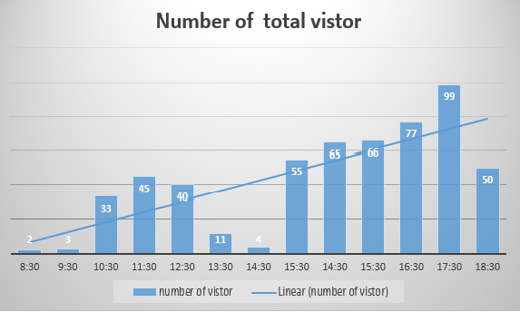
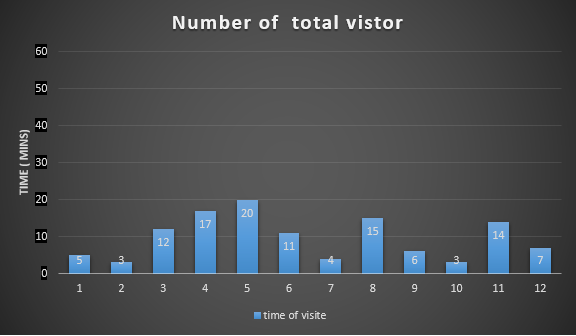

# Evaluation

This document defines how this project works in technical point of view and user point of view and analysis them to carry out the result for improve services of system .

 ## Technical point of view 
 (due to the current lockdown we cannot deploy our application in a real scenario)
 
 ### we have to know which product we will provide that need deadline and tool , etc are requirement.
      
      •Product                                                   Application for a Museum
      •Design stage                                        Concept design, Prototyping, programing 
      •Product representation                        Storyboard, Participant’s own device, Application
      •Purpose of evaluation                              find the best service alternative for visitor
      •Study location                                  Usability lab, Online  study
      •Participants                                           All visitors of the museum 
      •Time restrictions                                 3 months (from assignment to results)
      •Equipment, tools                                IoT sensors, smartphones, programing, cloud infrastrucure
      •Skills of researchers                              Programers, familiar with IOT systems
 
 ## User point of view    
 ### Why we must evaluate our system?
 •To  determine the quality of UX

    •Measuring UX, e.g. to get out a score 
    •Requirements fulfilled? Targets achieved? 
    •Comparison of several designs
    
 •To  find out improvement areas
 
    •Why does certain UX emerge?
    •What you cannot evaluate, you cannot improve
    
### User experience evaluation:
   Methods to reveal how user feels about your design.
   
   UX evaluation is different from usability evaluation.
   
   User experience:
   
    •How a person feels about using a system 
    •Beyond pragmatic utility and usability 
    •Subjective, holistic, emotional, long-term
  
  User Experience Evaluation Methods: 
  
    •Some kind of material being evaluated 
    •Not only understanding user behavior/needs
    •Focus is NOT on inspirational / co-creation methods
    •Part of the iterative design/development process,  resulting in input for the next phase
      
 #### How to evaluate user experience?
 
 There are a lot of methods to evaluate user experince Also techniques that help to collect experiential data such as 
 
    •questionnaires
    •measuring in the lab 
    •self-reporting during visiting
    •observing
    •etc
    
But due to the current lockdown, and to our difficulty on testing the application in a real scenario, this evaluation becomes more complex.

For this project we decided to gather data from user application on how much time they spend in each section and how much time they visited all part in the museum.

For example:

We thought that in a real scenario we could use these data, and create a score based on how much time a user spends in the suggested section of the museum, but for now this is not possible.
So we will evaluate the user experience using mockups, and after every demo of these prototypes we will collect feedback asking for feedbacks, trying to improve UX and to make our application more and more interactive.
The questions will be mainly on the User interface and on the services that the application will provide. If we will add some new feature to the application we will ask the user if this could be used or if it could be an interesting thing to add.

### How to evaluate the technical part?
To evaluate the system from a technical point of view the main thing that we can do is to do tests on the maximum load that it can handle. This operation, to better understand the performances of the single parts of the system, can be carried on each of them. So in an ideal situation we would have done some load tests on:
* ndixnoanxoiasn
* asnnxcoasuicnsadiu 
* dnucnuciuicnb
The evaluation of the technical part due to the current situation is something that is not vaery simple. On a real test we could imagine to create some controlled scenarios with few devices per section, and test the load that
